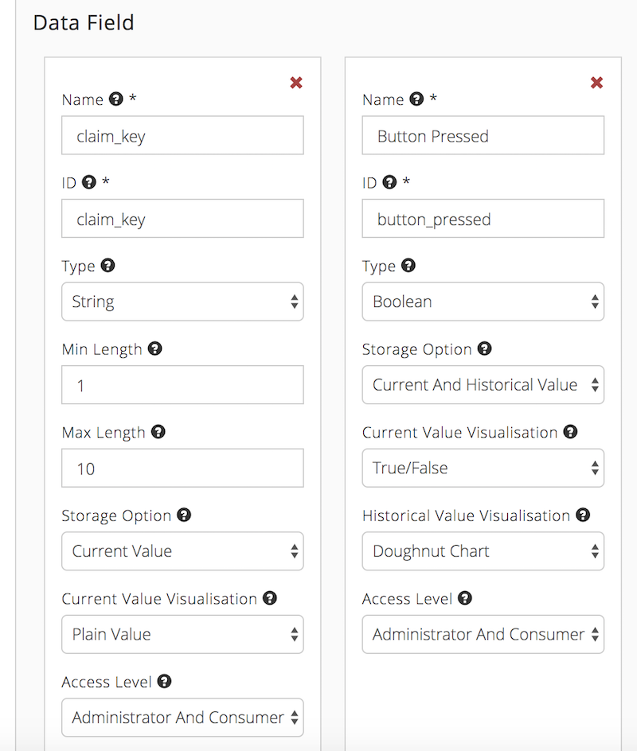
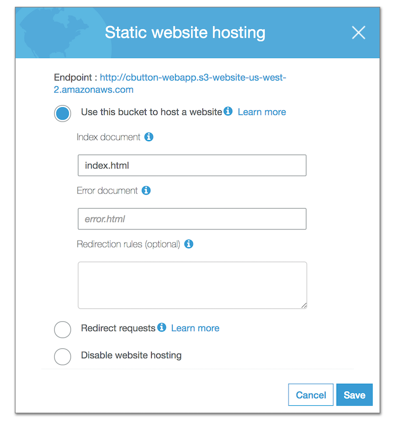

# **cButton**

This is a consumer facing web app using the [Conctr](conctr.com) Platform as its backend. The app provides consumers with an interface to view, change and add functionality to compatible IoT buttons. These devices must be activated and configured on the cButton app.

### Created By
Rashid Elhouli, [GitHub](https://github.com/elhoulir)

Peter Cavalot, [GitHub](https://github.com/peytr)

Drew Noll, [GitHub](https://github.com/oheydrew)

Meng Lim, [GitHub](https://github.com/mengolicious)

Glenn Greening, [GitHub](https://github.com/waltandmartha)

- [**cButton**](#cbutton)
    - [**Getting Started**](#getting-started)
    - [**Installing Prerequisites**](#installing-prerequisites)
    - [**API Keys & Configuration**](#api-keys--configuration)
    - [**Creating New Device Model**](#creating-new-device-model)
    - [**Running The Server**](#running-the-server)
    - [**Theming / Material UI Usage**](#theming--material-ui-usage)
      - [**Material UI React Components**](#material-ui-react-components)
      - [**Theming and Styling the Material-UI Components**](#theming-and-styling-the-material-ui-components)
  - [**Action Triggers**](#action-triggers)
    - [**AWS Lambda**](#aws-lambda)
    - [**AWS API Gateway**](#aws-api-gateway)
    - [**AWS Simple Email Service**](#aws-simple-email-service)
  - [**Deployment onto AWS S3 and Cloudfront**](#deployment-onto-aws-s3-and-cloudfront)
    - [**AWS S3**](#aws-s3)
    - [**Cloudfront**](#cloudfront)


### **Installing Prerequisites**

To run this app, you require: 
- The lastest version (**at least version 10**) of NodeJs, which can be found [here](https://nodejs.org/en/). 
- The latest version of npm, which can be found [here](https://docs.npmjs.com/getting-started/installing-node).

- Once you have cloned the repo and installed NodeJs and npm, download all the packages by running the following command (ensure you are in the cbutton/web directory):

  ```
  ~/cButton/ $ npm install 
  ```

- Once all the packages have been installed, we suggest you configure your app with the correct CONCTR App ID, and other relevant keys. See [**API Keys & Configuration**](#api-keys--configuration)


### **API Keys & Configuration**

All keys live in the `src/config.js` file. You will need to configure the following:

1. **OAUTH_GOOGLE_CLIENT_ID:** 
   - Have a look at the `Google oAuth` docs [here](https://developers.google.com/adwords/api/docs/guides/authentication) and follow the steps to setup an account. 
   - Once your account is set up, add the following credentials for the `client key`:
      - Within `Authorised Javascript Origins`:  
          - http://localhost:3000 (For development)
          - https://api.staging.conctr.com (To allow the conctr access)  
          - **NOTE:** When the app is deployed, you **MUST** add the new website URL to this list. 
    - Now, within `Dashboard` search for `Google+ API` and `enable` the `Google+ API`. 
    - ONLY use the `client key` **DO NOT** use any `secret key`.
  
2. **CONCTR_APP_ID:** 
    - Sign up to the conctr service [here](https://conctr.com/). 
    - Once signed in, `create` a new app 
    - Use the `App ID` to configure the cbutton web-app.
  
3. **RECAPTCHA_SITE_KEY:** 
    - This public key works co-dependantly with the private key in the CONCTR backend. Therefore it **DOES 
NOT** change. 
    - **NOTE:** When deployed, the reCAPTCHA `Domains` list must be configured with the newly deployed website's `URL`. This can be only done by **Mystic Pants** Developers, therefore you must get in contact with them for this. However, if the app is deployed with a URL ending with `conctr.com` **NO** configurations need to be made. 

4. **ACTION_TRIGGER_API_KEY:** 
    - To generate an action trigger `API Key`, take the following steps:
    - Go to your `conctr` dashboard 
    - Within your Application: Go to the `API Keys` section. 
      - In the `select policy` input field select `ACTION_FULL_ACCESS` and `RULE_FULL_ACCESS` tags.
      - Then in `API Key Name` input field give it a name of your choice and then click `create`. 
    - Your `API Key` will be generated, use this key. 
    - **DO NOT** use the `Admin` Policy `API Key`.     

5. **DEVICE_CLAIM_AWS_LAMBDA_API_GATEWAY:**
    - Once you have completed the steps for [AWS API Gateway](#AWS-API-Gateway) , you will be given an `Invoke URL`. This `URL` goes here. 

6. **SES_ARN:**
    - Part of the setup in the `AWS Simple Email Service`, you will be given an `Identity ARN`. Follow the steps in  [AWS Simple Email Service](#AWS-Simple-Email-Service) and place the newly generated `Identity ARN` here. 
   
7. **SES_SOURCE:** 
    - Once you complete the initial setup steps for the [AWS Simple Email Service](#AWS-Simple-Email-Service) you will find the `source`. This goes here. 

  
These keys are all publicly accessible, make sure **NOT** to store any `secret keys` here. This App is Front-End Only and thus does not store secret keys.


### **Creating New Device Model**
- Log in to your conctr backend
- Click on `Models`
- Click on `Create Model` 
- Enter a model `name` and the `ID` field will self populate. 
- Keep the `Transform` to `none`
- For the `Data Field` section copy the setup from the image below: 
- Once you have setup your `Data Field` click `create model`.
- For more info on this have a look at the Conctr API Docs 
[here](https://api.staging.conctr.com/#tag/Model)




### **Running The Server**

Once configured, you can start the development (not-deployed) version of the app on localhost, by running the following command:

```    
~/cButton/ $ npm start
```

### **Theming / Material UI Usage**

#### **Material UI React Components**
Style theming / Components are by **Material-UI** - [DOCUMENTATION LINK](https://material-ui.com/getting-started/usage/)

[](https://material-ui.com/)


[Material UI](https://material-ui.com/) is a React-Component library (the most popular library of it's type at the time of development) used by over 35,000 developed apps worldwide. It provides our React App with pre-made, customizable components based on the [Google Material Design](https://material.io/design/) Framework.

We chose this path for a number of reasons: 

1) **Ease of development** - Access to a supportive, fully documented community of app developers using these components
2) **Uniformity amongst components and style** - This helps with a cohesive look and feel
3) **One single place for theme configuration** - Setting App colours and global defaults at the top-level of the app is easy with the app *Theme*.

As a result of this choice, a **LOT** of the documentation you may need for customizing this App for yourself has been pre-written by the Material-UI Team, with component examples and API documentation- and you can find all these docs [here](https://material-ui.com/getting-started/usage/). If you've a question about how any non-custom components work, it'll all be in that documentation.

#### **Theming and Styling the Material-UI Components**

[Link to Material UI Docs on Theming](https://material-ui.com/customization/themes/)

The whole idea of using these components is that they can be styled at a global level, rather than having to style every single page or component. These components use In-Line JSS (Javascript CSS), and a lot of these JSS variables point to the **Default Theme**. 

The Default Theme lives inside `src/theme/defaultTheme.js`, and includes the `theme` object itself, as well as the necessary loader/setup files (which you should not need to modify). To change global component colours and styles, you can change them inside the `defaultTheme.js` `theme` object. More info about specific variables inside this object at the 
[Material UI Docs on Theming](https://material-ui.com/customization/themes/).

**defaultTheme.js**: 
```javascript
const theme = createMuiTheme({
  palette: {
    primary: {
      main: '#676aB0' // CONCTR 'Purple'
    },
    secondary: {
      main: '#FFC63e' // CONCTR 'Mustard'
    },
    background: {
      default: '#e3e6ea' // CONCTR 'Grey'
    }
  },
  spacing: {
    unit: 8
  }
});
```

As you can see, we've added some basic defaults for you, based on the CONCTR colour styles. You can easily change the colours for "primary" and "secondary" buttons, as well as the general "background" colour of the App. Changing the "spacing:unit" will affect the global padding levels for all components, so use this one warily. 

There are many more variables which can be imported here, and this `theme` object then gets passed down to each of the pages in our `src/pages` folder. Here, the theme is imported into the `styles` variable, where these theme variables can be accessed if needed. 

More info at the [Material UI Docs on Theming](https://material-ui.com/customization/themes/).


## **Action Triggers**

The action triggers on the **cButton app** rely on AWS services to run, namely `AWS Lambda`, `AWS API Gateway` and `AWS SES`. This section will guide you through setting up these services to work with the app.

**NOTE:** This app is currently configured to perform only **TWO** actions:
  - Make a HTTP Request
  - Send an email
  - SMS is currently **NOT** configured to work with the app. 

For further development and implementation of more actions, please have a look at the conctr docs [here](https://api.staging.conctr.com/#tag/Model)

The first thing to is:
  - Create an AWS account or sign in to the AWS Console [here](https://aws.amazon.com/).
  

### **AWS Lambda**
- In AWS Console search the Amazon services for `Lambda` and select it.
- In the AWS Lambda console click `Create function`
- Within `create function`, select the `Author from Scratch` tab
- In the `Author from Scratch` form field:
  - Enter a `name` of your choice
  - For `Runtime` select `Node.js 6.10` 
  - For the `Role` select `create new role from template`
  - Enter your own `Role Name`
  - For `Policy Templates` select `Simple Microservice permissions`
  - Then click `create function`
- Once your function is created, within your function, do the following:
  - Copy the code below and paste it into the `Function Code` section. 

```javascript
const https = require('https');

const app_id = 'YOUR APP ID'; 
const api_key = 'YOUR ADMIN POLICY API KEY'; 

exports.handler = (event, context, callback) => {

const device_id = event.device_id;
const consumer_email = event.consumer_email;
const consumer_claim_key = event.consumer_claim_key;

function getDevice() {

  const options = {
    host: 'api.staging.conctr.com',
    port: 443,
    path: `/data/apps/${app_id}/devices/${device_id}`,
    method: 'GET',
    headers: {
      'Content-Type': 'application/json',
      'Authorization': `api:${api_key}`
    }
  };

  const getReq = https.request(options, function (res) {
    res.on('data', function (data) {
      const returnedData = JSON.parse(data);
      const claim_key = returnedData.data.claim_key;
      if (claim_key === consumer_claim_key) {
        claimDevice();
      } else {
        callback('Invalid claim key!');
      }
    });
  });

  getReq.end();
  getReq.on('error', function (err) {
    callback(err);
  });
}


function claimDevice() {

  const options = {
    host: 'api.staging.conctr.com',
    port: 443,
    path: `/admin/apps/${app_id}/devices/${device_id}/adminclaim`,
    method: 'POST',
    headers: {
      'Content-Type': 'application/json',
      'Authorization': `api:${api_key}`
    }
  };

  const getPost = https.request(options, function (res) {
    const statusCode = res.statusCode;
    if (statusCode === 200) {
      callback(null, {
        statusCode: statusCode
      });
    } else {
      callback('Device claim failed');
    }
  });

  getPost.write(JSON.stringify({
    "consumer_email": consumer_email
  }));
  getPost.end();
  getPost.on('error', function (err) {
    console.log("Error: ", err);
    callback(err);
  });
}
getDevice();
};

```

  **NOTE:** For the above code block, you must replace the following:
  - `app_id` with the same App Id used in the `/src/config.js` file.
  - `api_key`: this is found in the conctr dashboard. Go to your app and find the `ADMIN POLICY API Key`.
  
  Do **NOT** use any keys from the above image, it will **NOT** work with your setup. These are just examples.
- Once you have added the code block, click `save` and that should complete your Lambda Function setup. 
- Now the next step is to set up the `AWS API GATEWAY`. The next section covers this.

### **AWS API Gateway**

- In the AWS Console search for `API Gateway` and select it.
- Click `Get Started` or `Create API`
- Select `New API`
- Within `Settings` enter your own `API name`
- Then click `Create API`
- Click on `Actions` drop down selector and choose `Create Resource`. Within `New Resource Setup`:
  - Add a name of your choice to the `Resource Name` input field. The `Resource Path` field will automatically populate once the name is entered. 
  - Check the `Enable API Gateway CORS` tick box option
  - Then click `Create Resource`
- Now go back to the `Actions` drop down selector and choose `Create Method`. A drop down selector will appear under `/resource` and `OPTION`, click on this selector and choose `POST` and then select the tick box option. Within the `/resource - POST - Setup`:
  - For `Integration type` select `Lambda Function`
  - For `Lambda Function` enter your previously created Lambda function's name and this should self-populate and select your function. **NOTE:** If you have  created multiple Lambda functions, be sure to select the **CORRECT** one to use for this API. 
  - Click `Save`
  - Click `ok` for the popup box
- Now you need to generate a `URL` for your newly created API. 
  - Go to `Actions` drop down selector and choose `Deploy API` 
    - For `Deployment Stage` select `[new stage]`
    - Enter a name of your choice in the `Stage Name` field
    - Click `Deploy`
  - The You will need the `Invoke URL` for the `/src/config.js` file. 
- **IMPORTANT:** Your last step is to add the `Invoke URL` to the `/src/config.js` file. This `URL` will be labelled as `DEVICE_CLAIM_AWS_LAMBDA_API_GATEWAY`
  
  

### **AWS Simple Email Service**

 
- In AWS Services, search for `Simple Email Services` 
- Within `Identity Management`, click on `Email Addresses`
- Click on `Verify Email Address`
- Enter your email address and click on `Verify Email Address` 
    - **NOTE:** This email address goes into `/src/config.js` as `SES_SOURCE`
- Once your email is verified, Select your newly verified email
  - You will see that you've been given an `Identity ARN`. 
  - This `Identity ARN` will go into your `/src/config.js` as `SES_ARN`
- Next you click on `Indentity Policies`
- Click on `Create Policy`, select `Generate Policy`
- Within `Policy Generator`:
    - For `Principals` input field, put `062137700115` 
    - For `Actions` select `ses:SendEmail` 
    - Click `Add Statement`
    - Click `Next`
    - Then click `Apply Policy`

Now your **SES** Service setup is complete.
 
## **Deployment onto AWS S3 and Cloudfront**


To build a release (deployable) version of the app, in command line:

```    
~/cButton/ $ npm run build
```
This is will optimize, compile, and dump the static files required to serve your application in a `/build` directory. 


### **AWS S3**

- Create an account or sign in to the AWS Console [here](https://aws.amazon.com/).
- Navigate to the S3 service and click `Create Bucket`. Make up a name for your new bucket, then click `Create`.

- Click on the newly-created bucket. Within the `Properties`, open the `Static Website Hosting` tab, and select `Enable website hosting`. Fill in '`index.html`' for the Index document, and then save. 

   

- Within the `Permissions`, go to the `Bucket Policy` tab. Copy and paste the policy below.

```json
    {
      "Version": "2012-10-17",
      "Statement": [
          {
              "Sid": "AddPerm",
              "Effect": "Allow",
              "Principal": "*",
              "Action": "s3:GetObject",
              "Resource":
              "arn:aws:s3:::bucket-name/*"
          }
      ]
    }
```
**Note:** You must configure the `bucket-name` to be the name of your newly created bucket. Once done, save the bucket policy. 

- Within the `Overview`, click on `upload` to upload all the content of the `/build` directory. Don't upload the `/build` folder, only upload its content.
- Once uploaded, your website will be live. To visit the website, open the `static website hosting` tab within `properties`, and find the URL labelled as `Endpoint`. (See static website hosting image above)


<!-- Talk about the need for SSL certificate for the site to run properly. Perhaps use a domain that is certified or configure aws to allow it to work??

**NOTE:** Your site must have an `SSL` certificate to work properly when deployed.  -->

### **Cloudfront**

CloudFront is the Content Delivery Network (CDN) service offered by AWS. CDNs optimize for speed by pushing your content out to edge locations around the world, making it highly available around the globe. If your users are only local, the performance offered by S3 may be just fine.

To set up the cloudfront, follow these steps:

- Go to the AWS console and select `Cloudfront`. 
- Click `create distribution`.
- Under web delivery method, click `get started`.
- Select the `Origin Domain name`. Once selected, this will automatically populate the `origin ID`
- Within the `Distribution settings`, set the `Default Root Object` to `index.html`.
- This should be enough to get it working, (you can add your own configurations) click `create`. 

For more info of deployment onto AWS S3 and Cloudfront, have a read of this [blog](https://medium.com/@omgwtfmarc/deploying-create-react-app-to-s3-or-cloudfront-48dae4ce0af).

**IMPORTANT** 
- You must configure all your `API keys and App ID` in the `/src/config.js` file, in order to make all app features work. Please refer to the [API Keys & Configuration](#API-Keys-&-Configuration) section of this document for all instructions.

